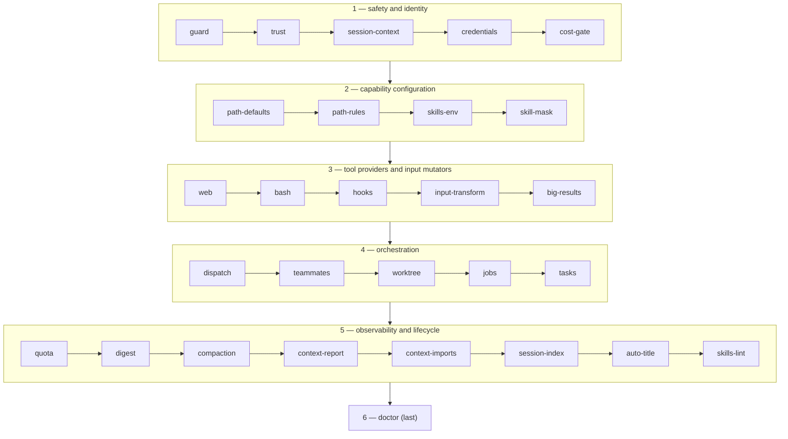
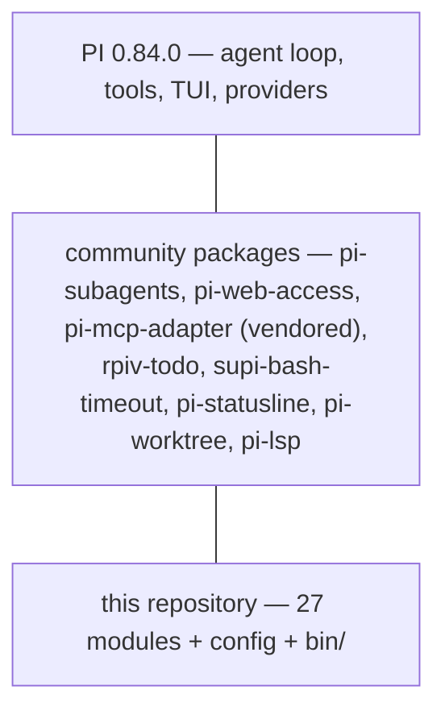
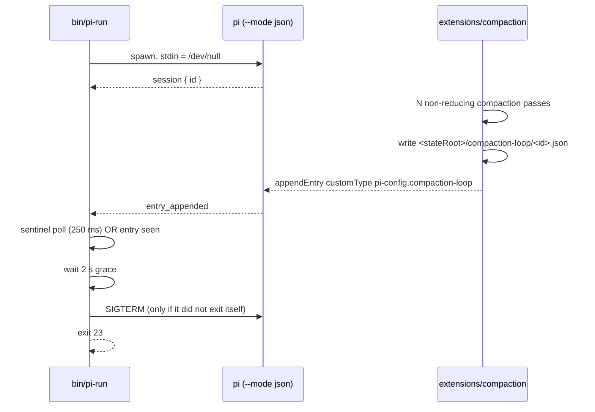

# Architecture

## One extension, twenty-six modules

PI discovers extensions by scanning `extensions/*.ts` and `extensions/<dir>/index.ts`. This
repository deliberately does **not** use that. `config/settings.json` names exactly one file:

```json
"extensions": ["~/pi-config/extensions/index.ts"]
```

`extensions/index.ts` is the composition root. Every other module exports `id` and
`register(pi)` — not a default export — and is imported and invoked here in a fixed order.

Three reasons, all of them consequences of how PI behaves:

1. **Directory discovery would load 26 files as 26 separate extensions**, in `readdir` order, and
   fail every one that has no default export.
2. **`readdir` order would decide the `tool_call` chaining order.** PI iterates `tool_call`
   handlers across extensions in load order and returns on the first `{block: true}`. If `bash`
   ran before `guard`, a call the guard was going to block would already have had its arguments
   rewritten.
3. **PI does not expose its `LoadExtensionsResult` to extensions.** A per-module `try/catch` in
   the composition loop gives [`/doctor`](../extensions/doctor.md) better granularity than the
   platform can.

## The load order, and why it is that order



The invariants encoded in that order, restated so nobody tidies them away:

| Invariant | Why |
|---|---|
| **`guard` is first, always** | A blocked tool call must never be mutated by `bash` or `hooks` first. |
| **`trust` is second, immediately after `guard`** | Its `session_start` deadman reads a load registry in which `guard`'s entry is already written, and its `project_trust` handler must be bound before any project resource is considered. |
| **`hooks` follows `guard`** | Hooks stack on the guard and may only *add* denial, never remove it. |
| **`path-defaults`, `path-rules` and `skills-env` come before their readers** | They publish configuration later modules read. `skill-mask` keeps its slot beside them; it registers nothing now, and moving a registered id is a bigger change than leaving it in place. |
| **`dispatch` precedes `teammates` / `worktree` / `jobs`** | Those register providers and vetoes into registries `dispatch` owns. |
| **`doctor` is last** | So its `session_start` pass observes everything above it. |

## What the per-module `try/catch` does and does not cover

It contains failures *inside* a `register()` call, and nothing else.

The imports in `index.ts` are static ESM, so every one of them resolves before the first line of
the module body runs. A module that throws at **import** time — a bad top-level `await`, a missing
native binding, a syntax error — takes the whole extension down before any handler exists to record
it, and `/doctor` reports nothing because `/doctor` never loaded either.

That is why `extensions/lib/manifest.ts` records both a load **and** an absence. A module missing
from the registry with no failure entry beside it was never even tried. `/doctor`'s `D-05` reports
both cases as errors, because the fix differs (read the stack trace, versus check the import graph)
even though the severity does not.

## Four modules that are *not* composed here

`session-index`, `big-results`, `context-imports`, `tasks` and `jobs` are also loadable standalone
via the `extensions/<dir>/index.ts` subdirectory pattern, and carry a default export for that. In
this repository's shipped configuration they are composed into `index.ts` like everything else; the
dual shape exists so a user who wants only one of them can point PI at it directly.

## The layer boundary: what is ours, what is a package, what is PI



The rule this project follows is **package-first**: adopt a community package where one exists and
survives review, and write custom code only for the remainder. Dependency count is not a
disqualifier. Every adopted package is pinned by version *and* tarball sha256 in
`config/packages.lock.json`, and `bin/pi-check`'s `PC-09`, `PC-18` and `PC-19` rules assert the
three-way agreement between `package.json`, the lock file and what is actually installed.

Concretely:

| Capability | Package | What this repo adds on top |
|---|---|---|
| Sub-agent dispatch | `pi-subagents` | tiers, depth limit, per-provider semaphore, worktree isolation, call-time model catalogue, a capability ceiling on the child, egress classes as annotation |
| Web search / fetch | `pi-web-access` | one pinned backend enforced at every `session_start`, proxy + CA plumbing, the `web_fetch` alias |
| MCP | `pi-mcp-adapter` (**vendored + patched**) | the project-config trust gate and the stdio spawn wrapper — see [Safety model](safety-model.md#mcp) |
| Task lists | `@juicesharp/rpiv-todo` | binding to this repo's conventions and a stale-`in_progress` nudge |
| Bash timeouts | `@mrclrchtr/supi-bash-timeout` | a ≥ 60 min ceiling the package deliberately does not implement, plus the same default injected independently |
| Worktrees | `@narumitw/pi-worktree` | detection, sub-agent isolation, crash-safe cleanup |
| Statusline | `@narumitw/pi-statusline` | segment selection and per-extension status icons |

Full attribution and licences: [Third-party components](../reference/third-party.md).

## The process boundary

One design fact shapes everything about running this unattended: **an extension cannot stop a
headless run from the inside.**

Measured against PI 0.84.0: inside a `session_before_compact` handler under `pi -p`, both
`ctx.shutdown()` and `ctx.abort()` return `undefined` and do nothing. `ctx.signal` stays
`undefined`, `isIdle()` stays `false`, and the session runs on into the next turn and exits **0**,
with stdout byte-identical to a control run that called neither. `{ cancel: true }` stops the
compaction but still exits 0 with no output. The only working exit is `process.exit()` from inside
the handler, and that is immediate: PI's own `session_shutdown` never fires and no other extension
gets to tear down.

So the compaction loop guard is split across the process boundary:



Two signals rather than one, because writing the sentinel is best-effort and returns `null` when
the state root is unwritable — a sentinel-only wrapper would report success in precisely the case
where the guard could not speak.

The 2 s grace exists so a `pi` whose extension is about to `process.exit(headlessExitCode)` keeps
its own exit code. Only a run that would have carried on is killed.

See [`bin/pi-run`](../operations/cli.md#pi-run) and [Exit codes](../reference/exit-codes.md).
