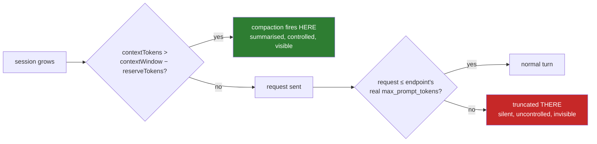

# Context windows: the rule that matters most

!!! abstract "The rule"
    **`contextWindow` must be `min(200000, what the endpoint actually serves)` — per model, per
    provider.**

    Declare it too high and your request is not compacted here, it is *truncated there*. Silently.

This is the single most valuable operational lesson in this project and it is worth the page.

## The mechanism, exactly

PI's compaction trigger is one line. Measured against 0.84.0's shipped
`dist/core/compaction/compaction.js`:

```text
shouldCompact  ⇔  contextTokens > contextWindow - settings.reserveTokens
```

And `CompactionSettings` has exactly three keys: `enabled`, `reserveTokens`, `keepRecentTokens`.

That is the whole trigger. Note what is not in it: there is **no absolute-threshold key**, and
**`reserveTokens` is a single global scalar** — one number for every model in the tree.

So there are exactly two levers, and only one of them is usable:

| Lever | Scope | Verdict |
|---|---|---|
| `compaction.reserveTokens` | **global** | Unusable as a threshold control. See below. |
| `providers.<p>.modelOverrides.<id>.contextWindow` | **per model** | The only per-model lever PI exposes. A pattern PI ships and uses itself. |

## Why raising `reserveTokens` is not the answer

Suppose you want compaction to fire at 180 000 tokens on a model whose catalogue entry claims a
1 000 000-token window. Through `reserveTokens` that needs `1000000 - 180000 = 820000`.

Now apply that same global scalar to every other model in the tree. Against a 200 000-token model,
`200000 - 820000` is **negative**: `shouldCompact` returns true for *any* context at all.
Compaction fires on every turn, its reduction falls under the loop guard's `minReductionRatio`, and
after three consecutive non-reducing passes the [loop guard](../extensions/compaction.md) aborts
the run.

This is not hypothetical. An earlier version of the compaction extension in this repository
*printed that advice* — a warning line recommending `reserveTokens: 820000`. Following it would have
broken three of five providers. Three faults were stacked:

1. The extension hard-coded PI's *default* reserve (`16384`) instead of reading the configured
   value, so the trigger it reported was never the trigger in effect. **A default was being printed
   as a measurement.**
2. The advice treated a global scalar as if it were per-model.
3. The project's own tracking had recorded the non-implementable approach as *applied*.

The fix is in `extensions/compaction/threshold.ts`, and the interesting part is not the arithmetic:
the module now resolves the reserve exactly the way PI does (compaction event → project settings →
global settings → PI default) and **carries the source alongside the value**, so a default can never
again be printed as a measurement.

## Why the catalogue lies, and why that is nobody's fault

PI ships a bundled model catalogue. It declares generous windows — for many hosted models,
1 000 000 to 1 050 000 tokens. Those numbers are true of the model as the vendor publishes it.

They are frequently **not** true of the endpoint you are actually calling. A gateway, a tenant
deployment, an enterprise proxy or a regional endpoint can and does serve a smaller window than the
upstream model's headline number, and it has no obligation to tell PI so.

Worse, "the window" is often two numbers that are not the same:

| Field | Meaning |
|---|---|
| `max_context_window_tokens` | total budget, prompt + completion |
| `max_prompt_tokens` | the cap on what you may **send** |

Measured against one enterprise Copilot gateway: a model advertised `264000` total but `200000`
prompt; another `328000` total but `200000` prompt; a family of models `400000` total but `272000`
prompt.

**The binding constraint on a request is the prompt cap**, and PI's `shouldCompact` compares against
`contextWindow`. So `contextWindow` must be the *prompt* cap. Anything larger lets the request reach
the gateway and get truncated there instead of compacted here — which is precisely the silent
failure the rule exists to prevent.



Declaring a window **below** what is served can only ever compact earlier than necessary. Declaring
it **above** can truncate silently. The asymmetry is the whole argument: under-declaration is
bounded and recoverable, over-declaration is neither.

## How to find the real number

Ask the endpoint. Most OpenAI-compatible gateways publish a model list, and enterprise gateways
generally publish per-model limits in it:

```bash
curl -s -H "Authorization: Bearer $YOUR_TOKEN" \
     "https://<your-gateway-host>/models" \
| jq -r '.data[]
         | [.id,
            .capabilities.limits.max_context_window_tokens,
            .capabilities.limits.max_prompt_tokens]
         | @tsv'
```

Then write one line per model into `config/models.json`:

```json title="config/models.json — the correction table"
"providers": {
  "<provider>": {
    "modelOverrides": {
      "<model-a>": { "contextWindow": 200000 },
      "<model-b>": { "contextWindow": 168000 },
      "<model-c>": { "contextWindow": 136000 },
      "<model-d>": { "contextWindow":  64000 }
    }
  }
}
```

Yes, that is one line per model. `modelOverrides` is the only per-model lever PI has; one line per
model *is* the entire mechanism. The block reads as a correction table because that is what it is.

For a model the gateway does not serve at all, the override is inert. For one it does, the override
is conservative. Either way it is safe to write it.

## The 200 000 cap, and what it costs

Capping at 200 000 even when the endpoint serves more is a deliberate choice, and it buys a
compaction trigger at `200000 - 20000 = 180000` with a `reserveTokens` of 20 000. Two secondary
effects are real and worth accepting knowingly:

- **Thinking budget is squeezed near the threshold.** PI clamps a request's `max_tokens` to
  `contextWindow - context - 4096`. At around 180 000 of context that lands near 16 900, against a
  `high` thinking budget of 24 576 — so thinking compresses to roughly 15 900 tokens. Self-limiting,
  and only in the turns immediately before a compaction that is about to fire anyway.
- **`isContextOverflow` now treats input above the declared window as overflow** for those models.
  That is the intended behaviour; it is also a behaviour change if you were relying on the larger
  number.

If you want a different cap, change the number. The *rule* is the `min()`, not the constant.

## Verifying it

The `/context` command exists because PI cannot answer this question. Enumerating every slash
command in the 0.84.0 binary: there is no `/context`. Occupancy appears only in the TUI footer as
`percent%/window`, which is honest but reads as "4.0 %" when the declared window is 1 050 000. And
`/session` prints a *cumulative billing total* that looks like occupancy and can be an order of
magnitude larger.

```text
/context
```

reports, separately labelled:

| Line | Source | Accuracy |
|---|---|---|
| live context | last assistant `usage.totalTokens` | **exact** — provider-reported |
| preamble | first-turn `cacheWrite` — system prompt + tool schemas + skill catalogue + first message | exact for that turn |
| compactable dialogue | `live − preamble` | an **estimate**, labelled as one |
| `keepRecentTokens` | `config/settings.json` | exact |
| window / trigger | the resolved `contextWindow` and `contextWindow − reserveTokens` | exact, **with its source** |

Run it before and after an override edit. On the session that motivated this work it reported
`window 1,050,000` before and `window 200,000` with a trigger at 180 000 after — which is how the
correction was made checkable at all.

## The related mystery: "Nothing to compact (session too small)"

You will meet this on a session that is visibly not small. It is the same missing measurement
wearing a different hat.

`prepareCompaction()` never looks at the context window. It walks session entries *backwards*
accumulating estimated tokens until it reaches `keepRecentTokens`. If the whole dialogue is smaller
than `keepRecentTokens`, the cut point never leaves the first boundary, the set of messages to
summarise comes out empty, and the caller raises "session too small".

The threshold that refused the compaction is **yours**, and it is applied to the dialogue only. The
preamble is excluded twice over: it is not a session entry, and it is rebuilt on every request, so
compaction could not shrink it even in principle. On the session that prompted `/context` being
built, the live context was 41 637 tokens of which 21 219 were preamble — leaving 17 896 of
compactable dialogue against a `keepRecentTokens` of 20 000.

The message is true and reads as false. `/context` is what tells them apart.

## Checklist

- [ ] For every provider, fetch the real per-model limits from the endpoint, not from memory.
- [ ] Where the endpoint distinguishes total window from prompt cap, use the **prompt cap**.
- [ ] Write `contextWindow = min(<your cap>, prompt cap)` per model in `modelOverrides`.
- [ ] Never over-declare. Under-declaring is safe; over-declaring truncates silently.
- [ ] Leave `reserveTokens` alone as a threshold lever. It is global.
- [ ] Verify with `/context` and confirm the reported window and trigger are the ones you intended.
