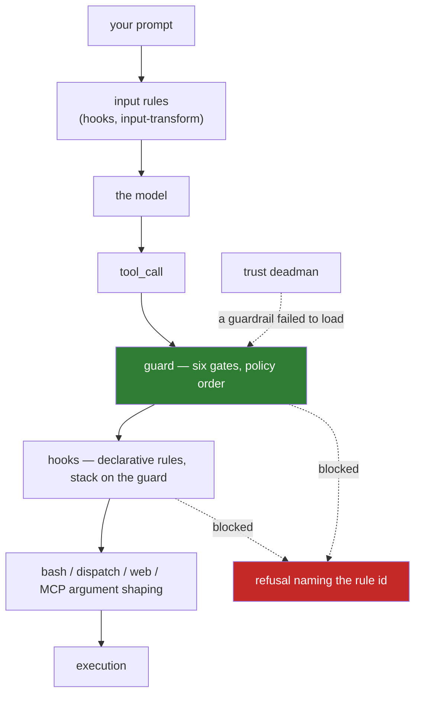

# Safety model

What this harness protects you from, what it does not, and why each mechanism sits where it does.

!!! abstract "The one-sentence version"
    This is a **permission layer**, not a sandbox: it refuses tool calls by policy before they run,
    it fails closed where a missing rule would be unsafe and open where our own bug would be, and it
    is honest about the three places where the enforcement is declarative rather than physical.

---

## The layers



Order is enforced by the composition root, not by `readdir`. PI iterates `tool_call` handlers across
extensions **in load order** and returns on the first `{block: true}`, so a call the guard is going
to block must reach the guard before anything rewrites its arguments. That single fact is why
[`extensions/index.ts`](architecture.md) exists.

---

## 1. The guard: six gates, three verdicts

**2026-08-14 — the deny-list inversion.** This used to be seven gates ending in a program allowlist
that refused any command not on a name list, and refused it outright headless because there was no
one to ask. That gate — and the escalation/session-inheritance machinery that existed only to widen
it — is gone by owner decision: deciding safety by *program name* never worked, because a short list
blocked ordinary work and a long list stopped meaning anything. What replaced it is a small, fixed
set of catastrophic command *shapes*, decided in code. Three gates were downgraded from blocking to
audit-only in the same change — they still see every call, they just no longer refuse one.

**2026-08-15 — `SEC` joins them.** The credential-path gate was the one the inversion left blocking
for a reason other than destruction. Owner decision, 2026-08-15: the same rule covers it — only
catastrophic commands block, and reading a file is not catastrophic. Two gates block now; four
observe. [What this costs is stated below](#credential-reads-are-no-longer-refused), unsoftened,
because it is the largest single thing this repository stopped doing.

The taxonomy is three verdicts, not two: **block**, **observe**, and (everything not named below)
**pass with no record at all**.

| Order | Family | Verdict | Overridable |
|---|---|---|---|
| 1 | `SEC-*` secret paths | **observes** — permitted, recorded | n/a |
| 2 | `DB-*` catastrophic bash | **blocks** | mostly not |
| 3 | `GIT-REWRITE` / `GIT-FORCE-PROTECTED` | **blocks** | with a written justification |
| 4 | `PRV-*` privileged commands | **observes** — permitted, recorded | n/a |
| 5 | `FS-*` write surface — writes outside cwd and the session temp dir | **observes** — permitted, recorded | n/a |
| 6 | `RTE-*` agent routing / specialist match | **observes** — permitted, recorded | n/a |

Gate 1 stays first in the order even though it no longer blocks: order decides which id a match is
*reported* under, and "touched a credential path" is a more informative record than whatever a later
gate noticed about the same command.

### Credential reads are no longer refused { #credential-reads-are-no-longer-refused }

A tool call may now read a credential file — an SSH private key, `~/.aws/credentials`, a `.env`, the
agent's own `auth.json` — and its contents land in the model's context and are therefore sent to
whichever provider serves the next turn. **There is no runtime control in this repository that
prevents this.** Not a weakened one. None. Specifically:

- The committed-secrets scrub rule (`PC-06`, run by `pi-check --all`) scans what git tracks for
  secret-shaped literals. It is a **push-time** gate and it protects the **repository**, not the
  model's context. It cannot see a value that was read into a turn and never written to a tracked
  file, and it is not a substitute for the gate.
- The OS-level sandbox package is declared in `config/packages.lock.json` and installed, but
  **nothing imports it** — it is on no runtime path here. Even once wired, its read-deny is
  documented as explicitly not a hard block, so it would not close this either.

What remains is the `guard.observed` record in the session transcript, and whoever reads it
afterwards. Detection is unchanged — the same pattern table, still tested by id — so the record tells
you exactly which credential path was touched. It just tells you after the fact.

Re-enforcing is a one-line change in `extensions/guard/gates/secret-paths.ts`, back from `observe`
to `denyWithEscapeHatch`. The table it would enforce is still there.

The four observing gates write a `guard.observed` audit entry — same shape as `guard.block`, plus
what was seen — every time they fire, and nothing they see is returned to the model. "Remove the
enforcement, keep the observability" was the explicit instruction: a form that stops being recorded
is a regression this tree's tests still fail on, even though nothing stops it from running. Ordinary git —
`reset --hard`, `branch -D`, `clean -fd`, `checkout -- .`, a force-push to a branch outside
`protectedBranches` — is not gated *or* recorded at all; it was judged genuinely ordinary, not merely
tolerated.

Read what gate 5 could and could not see before this change, and still cannot: it is a static text
check on the command string, and it never saw a write expressed inside an interpreter —
[Known limitations](../limitations.md#the-guard-is-not-a-sandbox).

Full reference and the consequences of relaxing anything:
[`config/guard.json`](../configuration/guard.md).

### Why it does not delegate to a sandbox

An OS-level sandbox package was reviewed and is not relied on: its read-deny is explicitly not a
hard block, and its network filter is a local TLS-intercepting proxy with a generated CA whose
interaction with corporate TLS inspection is unresolved. **This gate never delegates to it.** Two
layers with one guarantee between them is one layer wearing a disguise.

---

## 2. Fail closed, fail open — and which is which { #2-fail-closed-fail-open--and-which-is-which }

Both postures exist in this tree, deliberately, on opposite sides of one distinction:

> **Whose bug is it?**

| Layer | `onInternalError` | Reasoning |
|---|---|---|
| [`guard`](../extensions/guard.md) | **`"open"`** | A bug in *our* gate code must not blanket-block every tool call on your machine |
| [`hooks`](../extensions/hooks.md) | **`"closed"`** | A declarative rule *you wrote* that silently stops applying **is** the bug |

So a hook whose evaluation throws, whose action throws, whose script times out, or whose script is
missing **blocks**. And a `run` rule with no script in place blocks every matching call — which is
why none ships enabled.

The guard's fail-open posture would be a hole if nothing watched it. Something does.

---

## 3. The deadman

A guardrail that **failed to load** is a silent fail-open, and that is the worst outcome in the whole
design.

[`trust`](../extensions/trust.md) reads the module registry at `session_start`. If a guardrail module
is absent or failed to register, it announces the fact on every available surface and **blocks the
dangerous tools outright** — `bash`, `write`, `edit`, `multiedit`, `read`, `grep`.

The session still starts. It just cannot do anything that matters. An agent that refuses to work is a
bug report; an agent that works without its guardrails is an incident.

The registry records **both a load and an absence**, because a module that threw during registration
and a module whose import failed before any code ran are different problems with the same severity.
[`doctor`](../extensions/doctor.md)'s `D-05` reports both.

---

## 4. Project trust

PI asks whether a project directory may contribute its own extensions, hooks, skills, agents and MCP
servers. Answering yes means agreeing that a repository you just cloned may **execute its own
TypeScript** on your machine, in your environment.

- `defaultProjectTrust` stays `"ask"` in `config/settings.json`. Nothing enforces this mechanically —
  it is a decision you can undo, so do not undo it casually.
- [`config/trusted-roots.json`](../configuration/paths-and-trust.md) narrows the automatic *yes* to
  roots you named. Everything else returns "undecided" so PI's own prompt still runs.
- The module never answers "no" — that would suppress the prompt and turn a question into a silent
  refusal.

The rejected alternative was `defaultProjectTrust: "always"`, which trusts every directory PI is ever
started in. Narrow beats broad, and a list you maintain beats a switch you forget.

---

## 5. MCP: default-deny, twice { #mcp }

MCP is the highest-leverage attack surface in an agent harness, because an MCP server is **a process
you did not write, started by config you may not have read, holding whatever your environment
holds**.

Three mechanisms, and they are independent on purpose.

### The project-config trust gate

The vendored adapter reads a project's `.mcp.json` / `.pi/mcp.json` **before PI's trust decision
exists**. A local patch at `getConfigSources()` drops project sources unless approved.

!!! danger "Path trust and MCP-config trust are different questions"
    Path trust: *may PI run here without asking?* MCP-config trust: *may this directory name the
    processes this agent spawns with its full credential environment?*

    Wiring the first into the second made `git clone <hostile> && cd && pi` sufficient to spawn an
    eager stdio server holding every token in `process.env` — silently, with **no `tool_call` for the
    guard to see**. That is the failure the gate exists for, and it is why being inside a trusted
    root grants nothing here.

Approval is keyed on the project path **and** the sha256 digest of its MCP config, recorded by
`pi-mcp-approve` in `~/.config/pi-config/mcp-approvals.jsonl` (`0600`, append-only, last line wins).
Change the config, and the approval no longer matches.

### `hostConfigDiscovery: "off"`

PI will not adopt MCP server lists that other agent tools on the machine maintain. Everything you get
is what is written in `config/mcp.json`. Your tool surface should not change because unrelated
software updated.

### `mcp-stdio-guard`

A stdio MCP server is a child process that **inherits your environment**. The wrapper re-execs it
through `env -i` with an explicit baseline:

```text
HOME LOGNAME PATH SHELL TERM USER LANG LC_ALL TMPDIR
NODE_EXTRA_CA_CERTS HTTPS_PROXY HTTP_PROXY NO_PROXY https_proxy http_proxy no_proxy
```

Anything else is named explicitly in `MCP_STDIO_EXTRA_ENV`. An allowlist you can read in one line
beats a denylist you have to keep current.

Details: [`config/mcp.json`](../configuration/mcp.md).

---

## 6. Why some code is in-tree instead of in `node_modules` { #why-some-code-is-in-tree }

`pi-packages/pi-mcp-adapter/` is third-party source **committed into this repository**. That is
unusual and deserves an explicit justification.

The project-config trust gate has to live inside `getConfigSources()`. There is no hook, no option
and no wrapper position outside the module that sees project sources before they are merged — so the
gate either lives in the vendor's code or it does not exist.

Given that, the options were a `postinstall` script that rewrites somebody else's package on every
install, or vendoring. Vendoring wins on every axis that matters here:

- the patch is **visible in a diff** rather than applied invisibly at install time;
- it is **re-applicable and testable** on every version bump, and the vendor lock file marks
  re-application as mandatory;
- the exact reviewed bytes are pinned by sha256;
- the behavioural difference from upstream is written down rather than inferred.

Full attribution, licence, and a description of what the patch changes:
[Third-party components](../reference/third-party.md).

---

## 7. The process boundary, and `bin/pi-run`

!!! danger "An extension cannot abort a headless run from the inside"
    Measured against PI 0.84.0. Inside a pre-compaction handler under `pi -p`, both `ctx.shutdown()`
    and `ctx.abort()` return `undefined` and do nothing; `ctx.signal` stays `undefined`, `isIdle()`
    stays `false`, and the session runs on into the next turn and **exits 0** with stdout
    byte-identical to a control run that called neither.

    Worse: **`pi -p --mode json` exits 0 on a failed turn.** A scheduled job that checks `$?` cannot
    tell success from failure.

That is why [`bin/pi-run`](../operations/cli.md#pi-run) exists. It is a fail-closed wrapper that
forces `--mode json`, refuses any other mode, gives the child `/dev/null` on stdin, parses the
stream, and exits non-zero when the run actually failed:

| Code | Meaning |
|---|---|
| 20 | the turn failed |
| 21 | output truncated |
| 22 | no `stopReason` — the fail-open canary |
| 23 | compaction loop guard tripped |
| 24 | aborted |

Precedence **23 > 20 > 24 > 22 > 21**; `pi`'s own non-zero code always wins. Full table:
[Exit codes](../reference/exit-codes.md).

!!! warning "Never use bare `pi -p` unattended"
    Use `pi-run`. This is the single most important operational rule in the repository.

---

## What this does NOT protect you from

Stated plainly, because implied enforcement is worse than none.

| Not covered | Why |
|---|---|
| **Egress classes are not a network boundary — and since 2026-08-13 they are not a refusal either** | Nothing intercepts a socket, and nothing refuses a dispatch on account of a class any more. `egress` is a word from `routing.json` printed beside every model and agent. If you need a real boundary, build one at the network layer |
| **`path-defaults`' per-channel policy is declarative** | It computes and exports a value for other modules to honour at their own call sites. A tree with no such wiring enforces nothing from that channel |
| **A process that already started** | The guard gates tool calls. It does not contain a running process, its children, or what it does to the filesystem |
| **Any program, by name, at all** | There is no allowlist and no denylist keyed on program name any more. `sh`, `env`, `xargs`, `ssh`, `sudo`, `curl` — everything runs headless, with no prompt, unless the *command shape* it is used for matches `DB-*`/`GIT-REWRITE`/`GIT-FORCE-PROTECTED` |
| **A credential reaching the model's context** | Since 2026-08-15 `SEC-*` records a credential-path read and permits it. Nothing at runtime stops the file's contents from being sent to the provider — see [above](#credential-reads-are-no-longer-refused) |
| **A write expressed inside a program's own argument text** | `FS-*` reads the command as text, and even where it matches it only records, it does not refuse. `python3 -c`, `node -e`, `awk '{print > "…"}'`, a `make` target or a `$( )` subshell hides the destination where no static check can follow it. These are ordinary commands, not exotic ones |
| **`SEC-*`/`PRV-*`/`FS-*`/`RTE-*` refusing anything** | `PRV`, `FS` and `RTE` are audit-only since 2026-08-14, `SEC` since 2026-08-15. All four write a record; they do not ask permission and they do not block |
| **Model quality** | A small model emits malformed tool JSON at a materially higher rate, and PI exposes no repair-retry knob. That is a routing decision, not a safety one |
| **Prompt injection from fetched content** | Nothing here classifies retrieved text. The `web_fetch` result is data the model reads |

The honest framing: this raises the cost of an accident from *zero* to *deliberate*, and makes the
expensive mistakes require a human sentence. It does not make a hostile input harmless.

## Related

- [`config/guard.json`](../configuration/guard.md) — the sharpest file, key by key
- [`config/mcp.json`](../configuration/mcp.md) — the trust gate and the wrapper
- [Known limitations](../limitations.md) — the rest of the honest list
- [Architecture](architecture.md) — why the load order is the design
- The decisions behind this page: [ADR 0002](../adr/0002-fail-open-guard-fail-closed-hooks.md) (fail-open vs fail-closed), [ADR 0003](../adr/0003-vendor-the-mcp-adapter.md) (vendoring), [ADR 0004](../adr/0004-egress-classes-are-declarative.md) (declarative egress)
