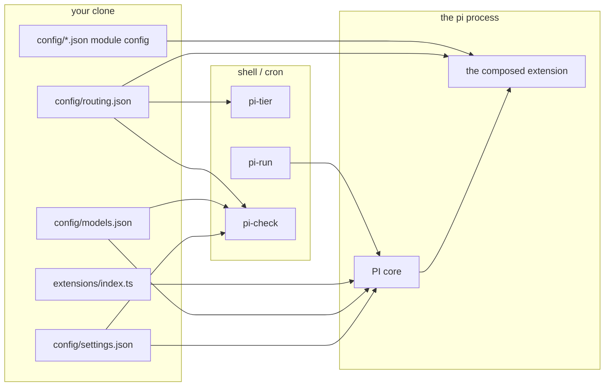

# Configuration layout

The single most important thing to understand about this project: **the configuration tree is not
copied, it is symlinked.** `~/.pi/agent/settings.json` is a link to `config/settings.json` in your
clone. Editing the file in the repository changes the live agent. There is no build step and no
second copy to keep in sync.

## The picture

```
~/.pi/agent/                          PI's config root ($PI_CODING_AGENT_DIR)
├── settings.json      -> ~/pi-config/config/settings.json     global agent behaviour
├── models.json        -> ~/pi-config/config/models.json       providers, credential *references*
├── routing.json       -> ~/pi-config/config/routing.json      tiers / egress / concurrency (ours, not PI's)
├── SYSTEM.md          -> ~/pi-config/SYSTEM.md                the system prompt (replaces PI's own)
├── AGENTS.md          -> ~/pi-config/AGENTS.md                the standing instructions
├── prompts            -> ~/pi-config/prompts/
├── hooks.yaml         -> ~/pi-config/config/hooks.yaml
├── web.json           -> ~/pi-config/config/web.json
├── web-search.json    -> ~/pi-config/config/web-search.json
├── guard.json  mcp.json  digest.json  quota.json              …and the rest of config/, one link each
├── path-defaults.json  trusted-roots.json  pi-lsp.json
├── keybindings.json  pi-statusline.json
├── extensions/subagent/config.json -> ~/pi-config/config/subagent.json   the ONE nested link — see below
├── agents             -> ~/pi-config/agents/                  sub-agent definitions
├── agents-private     -> ~/pi-config/agents-private/          yours, git-ignored (if it exists)
├── auth.json                                                  0600, written by /login — never committed
├── trust.json                                                 PI's own project-trust decisions
├── install-manifest.tsv                                       what the installer created; uninstall reads it
├── provider-notes.md                                          why your models.json looks the way it does
└── sessions/  models-store.json                               PI-owned, never linked

~/bin/
├── pi-run          -> ~/pi-config/bin/pi-run                the fail-closed headless wrapper
├── pi-check        -> ~/pi-config/bin/pi-check              offline config rules
├── pi-tier         -> ~/pi-config/config/bin/pi-tier        tier -> provider/model-id
└── mcp-stdio-guard -> ~/pi-config/config/bin/mcp-stdio-guard

~/.pi/secrets.env                    0600, git-ignored, NOT in the repo
~/.local/state/pi-config/            (or $XDG_STATE_HOME/pi-config) runtime state — see below

<project>/.pi/settings.json          deep-merged OVER global, only after the project is trusted
<project>/.pi/hooks.yaml             merged after the global hooks, only when trusted
```

`~/pi-config` is a *stable symlink* to wherever you actually cloned, created by the installer. Every
link above goes through it, and so do `config/settings.json`'s own `extensions` and `packages`
entries, so you can move or rename the checkout without editing anything.

!!! warning "Two things are deliberately **not** linked"
    **`extensions/`.** PI discovers `<agentDir>/extensions/*.ts` and `<agentDir>/extensions/<dir>/index.ts`,
    and would load every module as a separate extension in `readdir` order — breaking the fixed load order and failing every module
    that has no default export. `config/settings.json` names the single file
    `~/pi-config/extensions/index.ts` instead.

    One file *inside* that same directory is still linked, deliberately: the `pi-subagents`
    package reads its own config from exactly one path,
    `~/.pi/agent/extensions/subagent/config.json`, and nothing else. The installer `mkdir -p`s that
    one subdirectory and links only the single file into it — never `~/.pi/agent/extensions`
    itself, which is what would hand PI the extension source tree above.

    **`skills/`.** Nothing is tracked in this directory — the one worked example lives under
    `examples/skills/`, outside every search path — but the
    directory itself is the one place your own skills go: it is git-ignored, and the installer
    links it to `~/.pi/agent/skills`, the single search path `settings.json` names. See
    [Writing a skill](../extending/skills.md).

## The prompt layer

Three of the links above feed the system prompt, and they are not interchangeable.

| File | What PI does with it |
|---|---|
| `SYSTEM.md` | **Replaces** PI's built-in base prompt. Looked up as `<project>/.pi/SYSTEM.md` first — only in a trusted project — then `~/.pi/agent/SYSTEM.md` |
| `APPEND_SYSTEM.md` | **Appends** to whichever base is in force. Same two-step lookup. Not tracked: the row is `optional`, and a fork adds `config/APPEND_SYSTEM.md` if it wants one |
| `AGENTS.md` | Arrives further down, quoted inside a `<project_context>` block as *project-specific instructions*. Reference material, not identity |

`SYSTEM.md` ships populated, and what it says is deliberately narrow: how to work — act, delegate,
verify, report, disagree, and which tool to use for what. Anything true of one machine rather than
of the job belongs in `AGENTS.md`.

!!! warning "A custom base prompt silently drops PI's `Guidelines:` section"
    When `SYSTEM.md` is present, PI takes a different branch when it assembles the prompt: it emits
    neither the `Available tools:` summary nor the `Guidelines:` section that each tool contributes
    through its `promptGuidelines`. Losing the tools summary costs nothing — the full tool schemas
    still reach the provider, and the summary was only a list of names. Losing `Guidelines:` costs
    real behaviour: `edit`'s exact-match rules, `read`'s "use the tool, not `cat`", `write`'s
    "new files or complete rewrites only" and the todo package's task discipline all disappear with
    it. The shipped `SYSTEM.md` restates every one of them in its `# Tools` section. **If you
    rewrite that section, keep them**, or upgrade a package that adds a guideline and re-read what
    it now contributes — nothing compares the two.

    The parts that are *not* dropped: context files, the skills catalogue and the working-directory
    line are appended on both branches.

Changing any of these three takes effect on the next `pi` start. The prompt is assembled once, at
session start.

## Which process reads what



The split that trips people up: **`routing.json` is not a PI file.** PI has no concept of a tier.
`routing.json` is read by this repository's extensions and by `pi-tier`, and nothing in PI itself
knows it exists.

## Config files, one line each

| File | Read by | Decides |
|---|---|---|
| `config/settings.json` | PI core | Default model and thinking level, trust posture, retry, compaction reserve, and the `skills` / `prompts` / `extensions` / `packages` resource paths |
| `config/models.json` | PI core | Providers, wire APIs, credential *references* (`$VAR` / `!command`), `compat` blocks, and per-model `contextWindow` overrides |
| `config/routing.json` | this repo's extensions, `pi-tier` | The three tiers, per-provider egress class, per-provider concurrency cap, and `onProviderError` |
| `config/guard.json` | [`guard`](../extensions/guard.md) | Protected branches, and the tool names the routing observer watches |
| `config/dispatch.json` | [`dispatch`](../extensions/dispatch.md) | Depth limit, default tier and egress, agent registry directories, concurrency defaults |
| `config/subagent.json` | `pi-subagents` (linked to `extensions/subagent/config.json`, the package's own config path — not `dispatch.json`) | The package's per-batch concurrency cap, plus the now-dormant legacy `parallel` keys |
| `config/compaction.json` | [`compaction`](../extensions/compaction.md) | Loop-guard thresholds, headless exit code, pinned sources, absolute threshold |
| `config/digest.json` | [`digest`](../extensions/digest.md) | Whether digests run, the summariser tier, output directory |
| `config/quota.json` | [`quota`](../extensions/quota.md) | Token file path, TTL, pre-flight threshold |
| `config/tasks.json` | [`tasks`](../extensions/tasks.md) | Nudge cadence and staleness horizon |
| `config/path-defaults.json` | [`path-defaults`](../extensions/path-defaults.md) | Single default tier and per-channel egress policy, applied to every session |
| `config/bash-timeouts.json` | [`bash`](../extensions/bash.md) | Default timeout, ceiling, truncation limits |
| `config/hooks.yaml` | [`hooks`](../extensions/hooks.md) | Declarative tool-call and input rules |
| `config/mcp.json` | the vendored MCP adapter | MCP servers. **Ships empty** — see [Adding an MCP server](../extending/mcp-servers.md) |
| `config/trusted-roots.json` | [`trust`](../extensions/trust.md) | Which directory roots get an automatic "yes" to PI's project-trust question |
| `config/web.json` + `config/web-search.json` | [`web`](../extensions/web.md) | The pinned search backend and the `web_fetch` tool alias. Two files that must agree |
| `config/shell/pi-env.sh` | your shell | Telemetry off, `PI_CODING_AGENT_DIR`, proxy/CA posture, and sourcing `~/.pi/secrets.env`. Contains **no secret values** |
| `config/pi-statusline.json` | `@narumitw/pi-statusline` | Statusline segments and per-extension status icons |
| `config/pi-lsp.json` | `@narumitw/pi-lsp` | Language-server commands per file extension |
| `config/project-settings.example.json` | you | Template to copy into a repository's `.pi/settings.json` |
| `config/mcp.example.json` | you | Template. Never loaded. Copy entries into `config/mcp.json` |

Full key-by-key reference: **[Configuration](../configuration/index.md)** — what every key does,
what it ships as, and what breaks if you get it wrong.

!!! warning "Eleven of these are generated by the installer and git-ignored"
    `models.json`, `routing.json`, `mcp.json`, `settings.json`, `guard.json`, `trusted-roots.json`,
    `path-defaults.json`, `web.json`, `web-search.json`, `quota.json` and `subagent.json` are each
    produced from a tracked `config/<name>.default.json` template plus your install answers, and
    none of them is in git. On a fresh clone you will see only the `.default.json` half.

    Editing a generated file by hand is supported and survives a re-run — the installer patches
    rather than resets. It does not survive a fresh clone, so an edit that must be permanent belongs
    in the template too. See
    [Generated vs tracked](../configuration/index.md#fact-2-generated-vs-tracked).

## Rules this directory lives by

1. **No secret values, ever.** Only `$ENV_VAR` and `!command` references. `bin/pi-check`'s `PC-06`
   rule greps for key-shaped strings and fails.
2. **No `<PLACEHOLDER>` may survive installation.** `PC-10` rejects any `<[A-Z_]+>` left in an
   installed file.
3. **No bare model id outside `routing.json` and `models.json`.** Agents, skills and scripts name a
   *tier*. `PC-01` and `PC-08` enforce it.
4. **`defaultProjectTrust` stays `"ask"`.** Setting it to `"always"` globally disables the gate that
   stops a freshly cloned repository executing its own TypeScript. Nothing enforces it
   mechanically — keep it that way on purpose.
5. **Plain JSON, not JSON5.** PI will not parse comments. All commentary lives in these docs.

## Runtime state

Everything the extensions write at runtime goes under `$XDG_STATE_HOME/pi-config` (default
`~/.local/state/pi-config`), never into the repository:

| Path | Written by |
|---|---|
| `compaction-loop/<sessionId>.json` | the compaction loop guard's sentinel, read by `pi-run` |
| `compaction-threshold/*.json` | one-shot dedup markers for the threshold verdict |
| `jobs/<id>/` | the [background job](../extensions/jobs.md) store |
| `wt/<id>` and `<git-common-dir>/pi-worktrees.json` | the [worktree](../extensions/worktree.md) registry |
| `index.db` | the [session index](../extensions/session-index.md) |
| `~/.pi/agent/digests/` | [session digests](../extensions/digest.md) |
| `~/.config/pi-config/mcp-approvals.jsonl` | the MCP project-config approval ledger (`0600`) |
